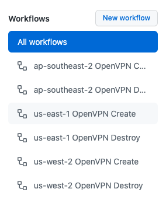
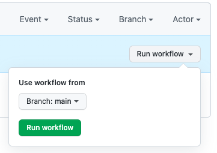
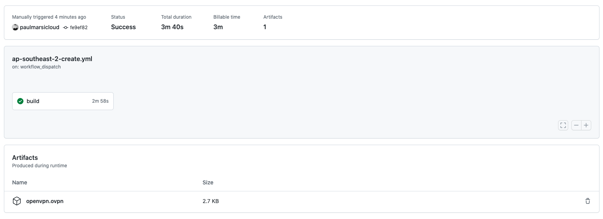

# OpenVPN Ephemeral GitHub Actions Template

## Overview

This repo provides an example template that supports a GitHub Actions pipeline building and destroying an OpenVPN EC2 server on demand. This template makes use of the [paulmarsicloud/openvpn-ephemeral/aws](https://registry.terraform.io/modules/paulmarsicloud/openvpn-ephemeral/aws/latest) Terraform Module and the pipeline is created using the [paulmarsicloud/terragrunt-awscli](https://hub.docker.com/r/paulmarsicloud/terragrunt-awscli) Docker container.

## Pre-requisites

In order to utilize this template repo, you will need an AWS Account with an IAM user that has programmatic access, and OpenVPN Connect installed on your local machine.

## Environment Variables

In order to use this template, simply clone/fork this repo, and update the following:

1. The `public_ip: <REPLACE ME>` environment variable in the example `<REGION>-create.yml` and `<REGION>-destroy.yml` files with your local public IP address (e.g. `curl 4.ipaddr.io`)
2. In the project Settings go to Secrets > Actions > and add environment variables for your `AWS_ACCESS_KEY_ID` and `AWS_SECRET_ACCESS_KEY_ID` values.

## Start/Stop OpenVPN Ephemeral Server

1. When ready to use OpenVPN, go to Actions
2. Click on the region name listed under Workflow for the region you want to use:
   
3. Click the `Run Workflow` option to start the `<REGION> OpenVPN Create` workflow for that region:
   
4. Wait for the `<REGION> OpenVPN Create` job to complete - this can take a couple of minutes
5. When completed, click on the workflow run and you will see the Artifacts at the bottom of your screen. You can download the `openvpn.ovpn` file to your local machine:
   
6. Open `openvpn.ovpn` on your local machine with your OpenVPN Connect application
7. When ready to destroy, simply disconnect from the OpenVPN Connect profile, go back to Actions, select the `<REGION> OpenVPN Destroy` Workflow for your region. Click the `Run Workflow` option and ensure that the destroy workflow completes successfully
